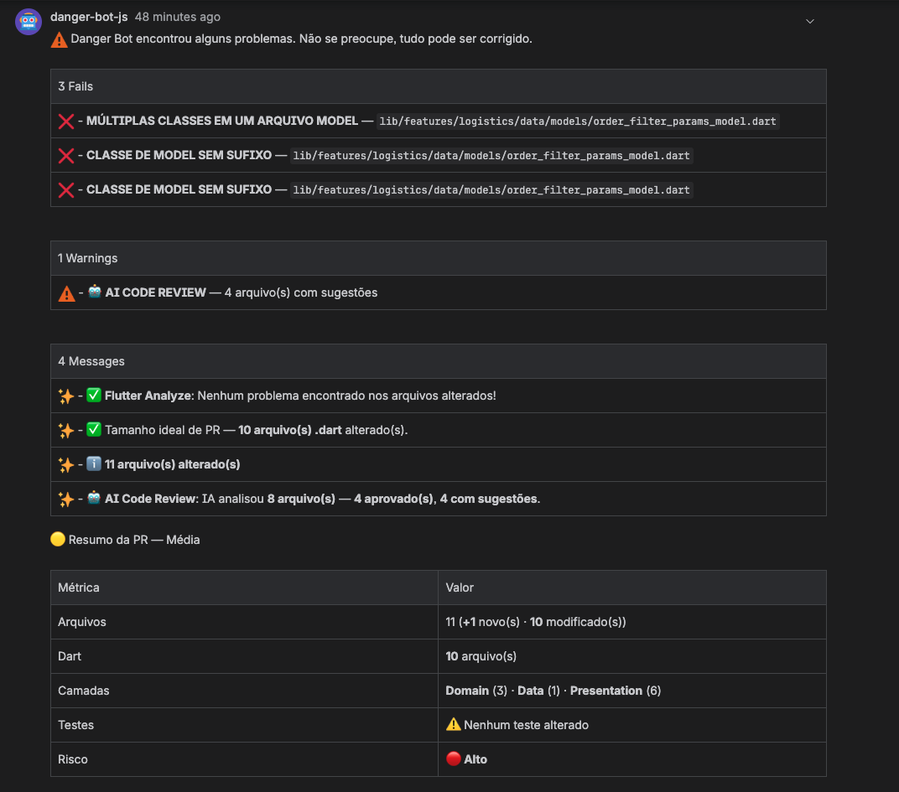
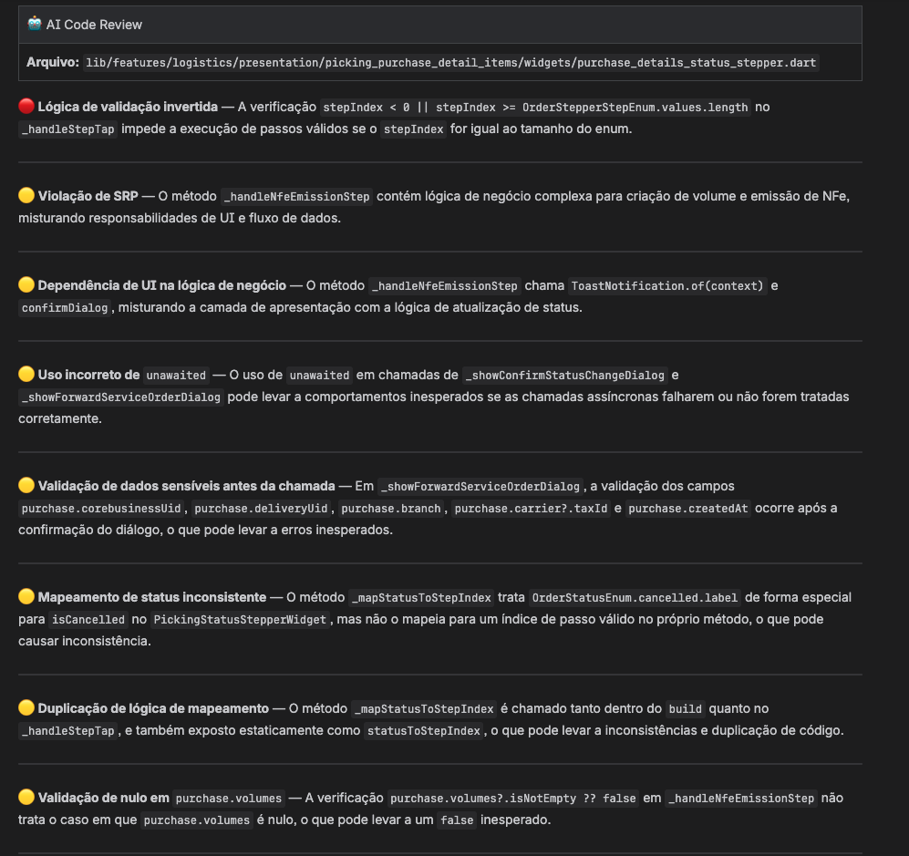
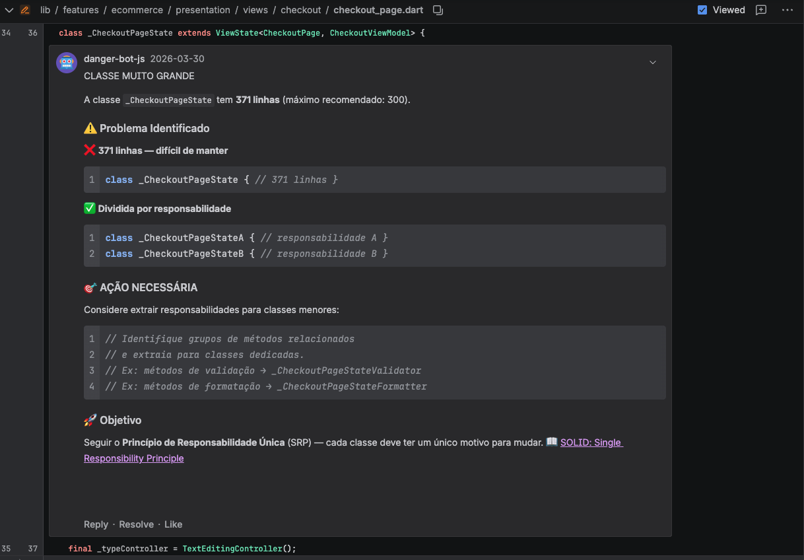

<p align="center">
  <h1 align="center">Danger Bot</h1>
  <p align="center">
    Automação de code review para projetos Flutter/Dart
  </p>
</p>

<p align="center">
  <a href="https://github.com/felipeduarte26/danger-bot"></a>
  <a href="https://nodejs.org"></a>
  <a href="https://www.typescriptlang.org/"></a>
  <a href="https://github.com/felipeduarte26/danger-bot/blob/main/LICENSE"></a>
  <a href="https://github.com/danger/danger-js"></a>
</p>

---

**Danger Bot** e um conjunto modular e extensivel de plugins para o [Danger JS](https://danger.systems/js/), focado em projetos **Flutter/Dart** com Clean Architecture. Ele analisa Pull Requests automaticamente durante o CI/CD e deixa comentarios com avisos, erros e sugestoes diretamente no PR.

---

## Danger Bot em Ação

Veja como o Danger Bot funciona em um Pull Request real:

### Comentario automatico no PR

O bot analisa o PR e deixa um comentario com **falhas**, **avisos**, **mensagens** e um **resumo completo** com métricas (arquivos alterados, camadas afetadas, risco e cobertura de testes):

<p align="center">
  
</p>

### AI Code Review (Gemini)

O plugin de **AI Code Review** analisa cada arquivo com o modelo Gemini e gera sugestoes detalhadas sobre **Clean Code**, **SOLID**, **seguranca** e **bugs potenciais**:

<p align="center">
  
</p>

### Comentarios inline no codigo

Alem do comentario geral, o bot tambem deixa **comentarios inline** diretamente nas linhas do codigo — como este exemplo do plugin **avoid-god-class**, que detecta classes grandes e sugere a divisao de responsabilidades (SRP):

<p align="center">
  
</p>

---

## Inicio Rapido

```bash
npm install --save-dev danger @felipeduarte26/danger-bot
```

Crie um arquivo `dangerfile.ts` na raiz do projeto:

```typescript
import { allFlutterPlugins, executeDangerBot } from "@felipeduarte26/danger-bot";

executeDangerBot(allFlutterPlugins);
```

Execute:

```bash
npx danger ci
```

> Para instalacao via Git, veja o [Guia de Instalacao](docs/INSTALACAO.md).

### Configuracao do projeto (opcional)

Gere um arquivo `danger-bot.yaml` para configurar plugins locais e arquivos ignorados:

```bash
npx danger-bot init
```

Veja mais em [Configuracao](docs/CONFIGURACAO.md).

---

## Plugins

O Danger Bot inclui plugins organizados em categorias:

### Pull Request

| Plugin                     | Descricao                                          |
| -------------------------- | -------------------------------------------------- |
| **pr-summary**             | Gera sumario automatico do PR com estatisticas     |
| **pr-size-checker**        | Alerta sobre PRs muito grandes                     |
| **pr-validation**          | Valida descricao, titulo e formato do PR           |
| **changelog-checker**      | Verifica se o CHANGELOG.md foi atualizado          |
| **merge-conflict-checker** | Detecta conflitos de merge com o branch de destino |

### Clean Architecture - Domain

| Plugin              | Descricao                                               |
| ------------------- | ------------------------------------------------------- |
| **domain-entities** | Valida entities, enums e subpastas dentro de /entities/ |
| **domain-failures** | Valida failures (`sealed class`, pattern matching)      |
| **repositories**    | Valida interfaces e implementacoes de repository        |
| **domain-usecases** | Valida usecases (interface + implementacao)             |

### Clean Architecture - Data

| Plugin               | Descricao           |
| -------------------- | ------------------- |
| **data-datasources** | Valida Data Sources |
| **data-models**      | Valida Data Models  |

### Clean Architecture - Presentation

| Plugin                             | Descricao                                             |
| ---------------------------------- | ----------------------------------------------------- |
| **presentation-viewmodels**        | Valida que ViewModels usem UseCases, nao Repositories |
| **presentation-try-catch-checker** | Detecta uso de try-catch na camada Presentation       |

### Qualidade de Codigo

| Plugin                         | Descricao                                                                                 |
| ------------------------------ | ----------------------------------------------------------------------------------------- |
| **clean-architecture**         | Detecta violacoes entre camadas (imports indevidos)                                       |
| **file-naming**                | Verifica nomenclatura `snake_case` em arquivos `.dart`                                    |
| **comments-checker**           | Forca uso de `///` ao inves de `//`                                                       |
| **late-final-checker**         | Detecta `late final` e sugere alternativas                                                |
| **barrel-files-enforcer**      | Forca uso de barrel files para organizar exports                                          |
| **security-checker**           | Detecta API keys hardcoded, `eval()` e vulnerabilidades                                   |
| **spell-checker**              | Verifica ortografia em identificadores Dart                                               |
| **identifier-language**        | Detecta identificadores e comentarios que nao estao em ingles                             |
| **class-naming-convention**    | Verifica se nomes de classes usam substantivos (Clean Code)                               |
| **avoid-god-class**            | Detecta classes muito grandes (SRP — responsabilidade unica)                              |
| **avoid-setstate-after-async** | Detecta setState apos await sem verificar mounted                                         |
| **date-type-checker**          | Detecta campos de data declarados como String ao inves de DateTime                        |
| **ai-code-review**             | Code review com IA (Gemini) — Clean Code, SOLID, seguranca e bugs (aviso, nao falha o CI) |

### Performance e Flutter

| Plugin                       | Descricao                                                                                             |
| ---------------------------- | ----------------------------------------------------------------------------------------------------- |
| **flutter-analyze**          | Executa `flutter analyze` e reporta problemas                                                         |
| **flutter-performance**      | Detecta operacoes custosas no `build()`                                                               |
| **column-row-spacing**       | Sugere `spacing` (Flutter 3.27+) em Column/Row em vez de SizedBox intercalados                        |
| **flutter-widgets**          | Verifica ordem de funcoes em widgets                                                                  |
| **mediaquery-modern**        | Forca APIs modernas do MediaQuery (Flutter 3.10+)                                                     |
| **memory-leak-detector**     | Detecta Controllers/Timers/Streams sem `dispose()`                                                    |
| **google-chat-notification** | Envia notificacao ao Google Chat (webhook) ao terminar o code review — Cards V2, gratuito (Workspace) |

---

## Importacao por Categoria

Alem de `allFlutterPlugins`, voce pode importar plugins por categoria:

```typescript
import {
  domainLayerPlugins, // 4 plugins (entities, failures, repositories, usecases)
  dataLayerPlugins, // 2 plugins (datasources, models)
  presentationLayerPlugins, // 2 plugins (viewmodels, try-catch-checker)
  cleanArchitecturePlugins, // 9 plugins (todas as camadas + validacao cross-layer)
  codeQualityPlugins, // 11 plugins (late-final, memory-leak, comments, security, barrel, identifier-language, class-naming, avoid-god-class, avoid-setstate-after-async, date-type-checker, ai-code-review)
  performancePlugins, // 3 plugins (flutter-performance, mediaquery-modern, column-row-spacing)
  executeDangerBot,
} from "@felipeduarte26/danger-bot";

executeDangerBot(domainLayerPlugins);
```

### AI Code Review (Gemini)

O plugin **ai-code-review** envia sugestoes de revisao com o modelo **Google Gemini** (`gemini-2.5-flash-lite`) no tier gratuito. As mensagens sao **avisos** (`warn`) — nao falham o pipeline.

Configure uma ou mais API keys no `danger-bot.yaml` (`settings.gemini_api_keys`) ou via env vars (`GEMINI_API_KEYS` / `GEMINI_API_KEY`). Multiplas keys permitem **rotacao** para distribuir o uso dentro dos limites do free tier (15 requisicoes/minuto e 1.000 requisicoes/dia **por key**). Gere keys gratuitas em [Google AI Studio](https://aistudio.google.com/apikey).

Detalhes: [Configuracao — settings](docs/CONFIGURACAO.md#settings) e [README do plugin](src/plugins/flutter/ai-code-review/README.md).

### Notificacoes no Google Chat

O plugin **google-chat-notification** envia um resumo ao **Google Chat** via **webhook de entrada** (incoming webhook, parte do Google Workspace — sem custo adicional para o envio pelo bot). A mensagem usa o formato **Cards V2** e mostra: **status** visual (verde / amarelo / vermelho conforme o resultado), **titulo do PR**, **autor**, contagens de **falhas**, **avisos** e **mensagens**, e **link para o PR**.

Configure `settings.google_chat_webhook` no `danger-bot.yaml` ou a variavel de ambiente `GOOGLE_CHAT_WEBHOOK`. O plugin deve ser o **ultimo** na fila (ja vem por ultimo em `allFlutterPlugins`) para refletir o resultado final da revisao.

Para criar o webhook: no Google Chat, abra o **Espaco** desejado > **Apps e integracoes** > **Webhooks** > **Adicionar webhook**.

Detalhes: [Configuracao — google_chat_webhook](docs/CONFIGURACAO.md#google_chat_webhook-plugin-google-chat-notification) e [README do plugin](src/plugins/flutter/google-chat-notification/README.md).

Ou selecione plugins individuais:

```typescript
import {
  prValidationPlugin,
  securityCheckerPlugin,
  cleanArchitecturePlugin,
  executeDangerBot,
} from "@felipeduarte26/danger-bot";

executeDangerBot([prValidationPlugin, securityCheckerPlugin, cleanArchitecturePlugin]);
```

---

## Callbacks

O `executeDangerBot` aceita callbacks opcionais para controlar o ciclo de vida:

```typescript
import { allFlutterPlugins, executeDangerBot, sendMessage } from "@felipeduarte26/danger-bot";

executeDangerBot(allFlutterPlugins, {
  onBeforeRun: () => {
    sendMessage("Iniciando analise automatica...");
    return true; // false cancela a execucao
  },
  onSuccess: () => sendMessage("Analise concluida com sucesso!"),
  onError: (error) => console.error("Erro:", error.message),
  onFinally: () => sendMessage("Pipeline finalizado."),
});
```

---

## CLI

O pacote inclui uma CLI para gerenciamento de plugins:

```bash
danger-bot list              # Listar todos os plugins
danger-bot create-plugin     # Criar novo plugin interativamente
danger-bot gen               # Gerar dangerfile de exemplo
danger-bot validate <file>   # Validar estrutura de um plugin
danger-bot init              # Gerar danger-bot.yaml de configuracao
danger-bot info              # Informacoes do projeto
```

> Documentacao completa: [CLI](docs/CLI.md)

---

## Plataformas de CI/CD

| Plataforma          | Guia                                              |
| ------------------- | ------------------------------------------------- |
| GitHub Actions      | [Ver guia](docs/pipelines/README.md)              |
| Bitbucket Pipelines | [Ver guia](docs/pipelines/BITBUCKET_PIPELINES.md) |
| Bitrise             | [Ver guia](docs/pipelines/BITRISE.md)             |
| GitLab CI           | [Ver guia](docs/pipelines/README.md)              |
| CircleCI            | [Ver guia](docs/pipelines/README.md)              |

---

## Documentação

| Documento                                  | Descricao                             |
| ------------------------------------------ | ------------------------------------- |
| [Inicio Rapido](docs/INICIO_RAPIDO.md)     | Comece em 5 minutos                   |
| [Instalacao](docs/INSTALACAO.md)           | Guia completo de instalacao           |
| [Guia de Plugins](docs/GUIA_PLUGINS.md)    | Como usar, configurar e criar plugins |
| [API Reference](docs/API.md)               | Referencia completa da API            |
| [Helpers](docs/HELPERS.md)                 | Funcoes auxiliares disponiveis        |
| [CLI](docs/CLI.md)                         | Comandos da CLI                       |
| [Exemplos](docs/EXEMPLOS.md)               | Casos de uso praticos                 |
| [Arquitetura](docs/ARQUITETURA.md)         | Estrutura interna do projeto          |
| [Desenvolvimento](docs/DESENVOLVIMENTO.md) | Como contribuir                       |
| [Commits](docs/COMMITS.md)                 | Padrao de Conventional Commits        |
| [Configuracao](docs/CONFIGURACAO.md)       | Plugins locais e arquivos ignorados   |
| [FAQ](docs/FAQ.md)                         | Perguntas frequentes                  |
| [CI/CD](docs/pipelines/README.md)          | Guias de configuracao por plataforma  |

---

## Estrutura do Projeto

```
danger-bot/
├── src/
│   ├── index.ts              # Exports principais
│   ├── types.ts              # Interfaces e tipos
│   ├── helpers.ts            # Funcoes auxiliares
│   ├── config.ts             # Loader do danger-bot.yaml
│   └── plugins/
│       └── flutter/          # Plugins Flutter/Dart
│           ├── pr-summary/
│           ├── pr-size-checker/
│           ├── clean-architecture/
│           ├── security-checker/
│           └── ...
├── bin/
│   ├── cli.js                # Entry point da CLI
│   ├── commands/             # Comandos (create, remove, list, etc.)
│   ├── templates/            # Templates de codigo
│   └── utils/                # Utilitarios
├── scripts/
│   ├── patch-danger.cjs      # Patches no Danger JS (postinstall)
│   ├── extract_dart_identifiers.js
│   └── setup_spell_check.sh
├── dist/                     # Build output (commitado para install via git)
└── docs/                     # Documentacao completa
```

---

## Requisitos

- **Node.js** >= 25.2.1
- **Danger JS** >= 13.0.7 (peer dependency)
- **TypeScript** 5.9+ (instalado automaticamente)

---

## Tecnologias

| Tecnologia                                             | Versao | Uso                                |
| ------------------------------------------------------ | ------ | ---------------------------------- |
| [TypeScript](https://www.typescriptlang.org/)          | 5.9    | Linguagem principal                |
| [Danger JS](https://github.com/danger/danger-js)       | 13+    | Framework de code review           |
| [Commander](https://github.com/tj/commander.js)        | 14     | CLI                                |
| [js-yaml](https://github.com/nodeca/js-yaml)           | 4      | Parser do danger-bot.yaml          |
| [CSpell](https://github.com/streetsidesoftware/cspell) | 9      | Spell checking                     |
| [eld](https://www.npmjs.com/package/eld)               | 2      | Deteccao de idioma                 |
| [wordpos](https://www.npmjs.com/package/wordpos)       | 2.1    | Classificacao gramatical (WordNet) |
| [ESLint](https://eslint.org/)                          | 9      | Linting                            |
| [Prettier](https://prettier.io/)                       | 3      | Formatacao                         |
| [Husky](https://github.com/typicode/husky)             | 9      | Git hooks                          |

---

## Contribuindo

1. Clone o repositorio
2. Instale as dependencias: `npm install`
3. Crie uma branch: `git checkout -b feat/minha-feature`
4. Faca suas alteracoes
5. Commit seguindo [Conventional Commits](docs/COMMITS.md): `git commit -m "feat: descricao"`
6. Push: `git push origin feat/minha-feature`
7. Abra um Pull Request

> Veja o [Guia de Desenvolvimento](docs/DESENVOLVIMENTO.md) para detalhes.

---

## Autor

**Felipe Duarte Barbosa**

- GitHub: [felipeduarte26](https://github.com/felipeduarte26)

## Licenca

[MIT](LICENSE)

## Suporte

- [Documentacao](docs/)
- [GitHub Issues](https://github.com/felipeduarte26/danger-bot/issues)
